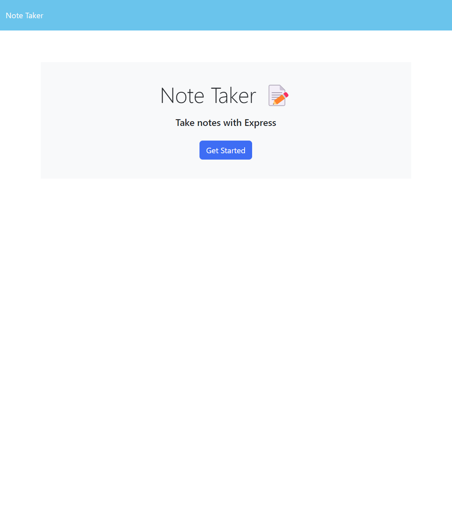
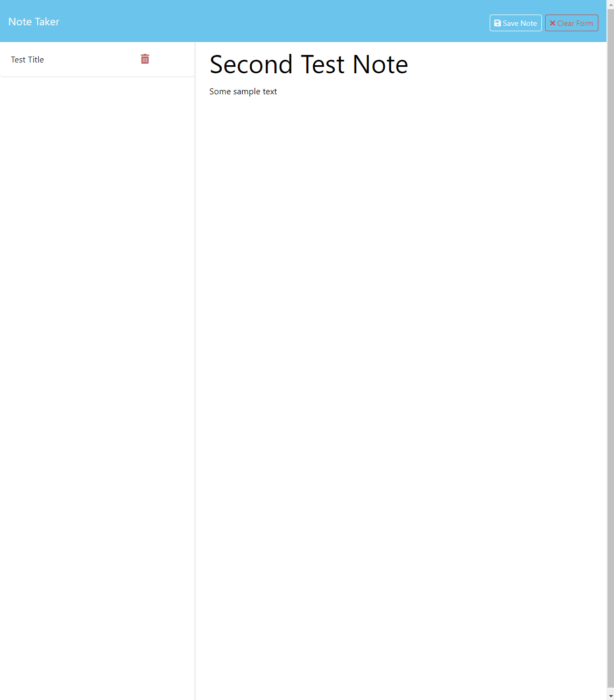

# Express JS Note Taker

# Description

Express JS Note Taker is a application that is used to write and save notes. This project is built from the ground up using JavaScript. The back end is written using Express.js and it saves and retrieves note data from a JSON file. 

The front end of the application gives the users some options to create a new note, view past notes or to delete notes. 

The application is deployed using Heroku and is viewable using this link... https://fathomless-oasis-02487-0520cb284ab3.herokuapp.com/

- The motivation for this application was two fold. First to create an online application which can be viewed anywhere by my family, used to add notes in a centralized location, and shared between family members. The second reason I build this application is get some hands on experience building a back end server for a webpage. 

- I built this project because of the need to have a way to share notes between family members.

- The application solves the problem of not being able to access notes created by other family members. 

- What I learned during the course of this project is how to build an express.js server.

## Usage

In order to use this application you only need to access it at the link provided above. 

Bellow are some photos of the deployed application

## Credits
EdX, Ross, Traversy Media